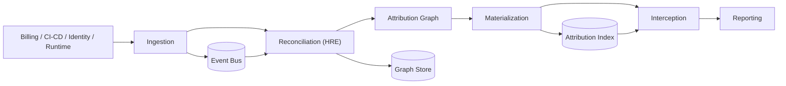

# AI Compute Intelligence (ACI)

Decision-time AI cost governance platform with calibrated attribution, policy enforcement, and fail-open interception.

## Why This Exists

Enterprise AI spend is visible at cloud-account granularity but usually not attributable to the team/workload level needed for governance, chargeback, and intervention. ACI closes that gap by combining:

- Immutable multi-source event ingestion.
- Heuristic reconciliation with calibrated confidence.
- Materialized O(1) attribution index for hot-path decisions.
- Safe interception with strict fail-open semantics.

## Demo First (Recommended)

### Run locally (30-second path)

Prerequisites:

- Python `3.12+`
- `bash`

```bash
./scripts/run_demo.sh
```

Open the demo:

- `http://localhost:8000/platform/`

If port `8000` is occupied:

```bash
ACI_DEMO_PORT=8010 ./scripts/run_demo.sh
```

Then open `http://localhost:8010/platform/`.

`./scripts/run_demo.sh` launches the explicit `demo` profile:

- single worker
- in-memory graph/event/index backends
- deterministic startup seeding
- auth bypass enabled only for the demo profile

The dashboard and attribution controls are populated on startup. Use **Bootstrap Demo Data**
only if you want to reset the demo state during a walkthrough.

In the UI:

1. Open **Execution Stream** from the top bar.
2. Click **Run Full Sequence**.
3. Inspect the **Latest Request/Response Payload** and **Log Stream** panels in the drawer.
4. Navigate the left rail across:
   - Overview
   - Attribution
   - Models
   - Teams
   - Interventions
   - Governance
   - Forecasting
   - Integrations
   - Glossary
   - FAQ

For a command-line walkthrough of the same scenarios, use [docs/demo-guide.md](docs/demo-guide.md).
For requirement traceability, see [docs/demo-feature-matrix.md](docs/demo-feature-matrix.md).
For an automated end-to-end demo verification, run `./scripts/smoke_demo.sh`.

## Runtime Profiles

### Demo profile

- Launcher: `./scripts/run_demo.sh`
- Compose: `docker compose -f docker-compose.demo.yml up --build`
- Backend selection:
  - `ACI_GRAPH_BACKEND=memory`
  - `ACI_EVENT_BUS_BACKEND=memory`
  - `ACI_INDEX_BACKEND=memory`
  - `ACI_INTERCEPTOR_CIRCUIT_STATE_BACKEND=local`

This is the recommended profile for investor and reviewer walkthroughs because it is deterministic,
single-process, and pre-seeded.

### Shared-backend profile

- Compose: `docker compose up --build`
- Backend selection:
  - `ACI_GRAPH_BACKEND=neo4j`
  - `ACI_EVENT_BUS_BACKEND=kafka`
  - `ACI_INDEX_BACKEND=redis`
  - `ACI_INTERCEPTOR_CIRCUIT_STATE_BACKEND=redis`

This path exercises the durable/shared topology. It is the right local profile for validating
backend wiring rather than for the shortest-path demo.

### Demo-to-PRD coverage

The frontend investor demo now includes the minimum scope from PRD Section 15:

- `DEM-01` Overview dashboard (spend summary, coverage, savings).
- `DEM-02` Six-layer attribution chain with method/confidence and request-level cost explanation.
- `DEM-03` Model Intelligence view (spend, volume, cost/1K, latency, trend, optimization potential, variance).
- `DEM-04` Teams view (spend, budget utilization, optimization potential, top models/apps, MoM trend).
- `DEM-05` Interventions view with multiple intervention types and statuses.
- `DEM-06` Governance view with mode selector and policy bundle.
- `DEM-09` Persistent `SIMULATED DATA` watermark across views.

## System Architecture



## Technical Guarantees

- Interceptor never performs synchronous graph traversal or remote policy RPC on the hot path.
- Fail-open behavior protects application availability under timeout/error conditions.
- Schema validation occurs before events enter the append-only bus.
- Policy and intervention decisions emit immutable audit events.
- Shared-backend mode supports Kafka, Redis, and Neo4j adapters behind explicit config.

## API Surface

### Public operational endpoints

- `GET /`
- `GET /health`
- `GET /live`
- `GET /ready`
- `GET /metrics`
- `GET /metrics/prometheus`

### Authenticated API endpoints (`/v1/*`)

- `POST /v1/events/ingest`
- `POST /v1/events/ingest/batch`
- `POST /v1/intercept`
- `POST /v1/trac`
- `POST /v1/policy/evaluate`
- `POST /v1/demo/bootstrap` (non-production only)
- `GET /v1/attribution/{workload_id}`
- `GET /v1/index/lookup?key=...`
- `GET /v1/index/stats`
- `GET /v1/dashboard/overview`
- `GET /v1/pricing/catalog`
- `POST /v1/pricing/estimate`
- `POST /v1/finops/synthetic`
- `POST /v1/finops/reconcile`
- `GET /v1/finops/drift`
- `POST /v1/forecast/spend`
- `GET /v1/interventions`
- `GET /v1/interventions/summary`
- `POST /v1/interventions/{intervention_id}/status`
- `POST /v1/interventions/cost-simulate`
- `POST /v1/integrations/notify`
- `GET /v1/integrations/deliveries`

## Security and Production Hardening

Implemented controls include:

- JWT auth on `/v1/*` (issuer/audience/scope/tenant validation).
- Startup-time guardrails preventing unsafe production config.
- Ingestion rate limiting and batch-size bounds.
- Durable-bus idempotency with tenant-scoped dedup keys.
- Kubernetes baseline hardening (`runAsNonRoot`, dropped capabilities, read-only root filesystem, probes, PDBs, network policies).
- Dependency and static-analysis gates in CI (ruff, strict mypy, pytest, CodeQL, dependency review).

See:

- [SECURITY.md](SECURITY.md)
- [docs/architecture.md](docs/architecture.md)
- [docs/releasing.md](docs/releasing.md)

## CI/CD and Reproducibility

GitHub Actions workflows in [`.github/workflows`](.github/workflows):

- `ci.yml`: lint, strict mypy, dependency checks, lockfile consistency, unit/integration/glass-jaw tests, docker smoke, SBOM artifact.
- `codeql.yml`: static analysis.
- `dependency-review.yml`: dependency risk gate on PRs.
- `deploy-gate.yml`: preflight + deployability gate (`push` to `main` and manual dispatch).
- `cache-hygiene.yml`: periodic cache maintenance.
- `release.yml`: version tagging, changelog generation, PyPI and Docker publishing, GitHub release creation.

Dependency reproducibility is anchored by `requirements.lock` and `requirements-dev.lock`.

## Performance and Validation

- Glass-jaw suite: `tests/glass_jaw/`
- Unit/integration coverage across API, event bus, graph, policy, interception, and regression controls.

Run quality gates locally:

```bash
ruff check src tests
mypy src tests --strict
pytest -q
```

## CI/CD

GitHub Actions workflows in [`.github/workflows`](.github/workflows):

- `ci.yml`: lint, strict mypy, dependency checks, lockfile consistency, unit/integration/glass-jaw tests, docker smoke, SBOM artifact.
- `codeql.yml`: static analysis.
- `dependency-review.yml`: dependency risk gate on PRs.
- `deploy-gate.yml`: preflight and deployability gate.
- `cache-hygiene.yml`: periodic cache maintenance.
- `release.yml`: manual SemVer release with quality gate, artifact build, and GitHub release publication.

See [docs/releasing.md](docs/releasing.md) for the operator guide on cutting releases.

## Repository Layout

```text
src/aci/
  api/            FastAPI service and auth middleware
  core/           Event bus, orchestration, schema validation
  hre/            Heuristic reconciliation engine
  graph/          Graph store abstraction
  index/          Materialization and serving index
  interceptor/    Fail-open gateway and circuit breaker
  policy/         Governance policy engine
  trac/           TRAC calculations
  carbon/         Carbon models
  equivalence/    Model equivalence verification
  benchmark/      Federated benchmarking protocol
  models/         Domain models

frontend/         Investor-facing demo UI
k8s/base/         Reference Kubernetes manifests
infra/onboarding/ CloudFormation/Terraform onboarding templates
docs/             Technical documentation
tests/            Unit, integration, and glass-jaw validation suites
wiki-src/         GitHub wiki source
```

## Wiki

- [wiki-src/Home.md](wiki-src/Home.md)
- [wiki-src/Technical-Architecture.md](wiki-src/Technical-Architecture.md)
- [wiki-src/Security-and-Trust-Boundary.md](wiki-src/Security-and-Trust-Boundary.md)
- [wiki-src/Operations-and-Deployment.md](wiki-src/Operations-and-Deployment.md)
- [wiki-src/Technical-Due-Diligence-Guide.md](wiki-src/Technical-Due-Diligence-Guide.md)
