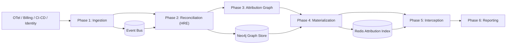

# AI Compute Intelligence (ACI)

Application-level cost, carbon, and confidence attribution for enterprise AI workloads.

## What This Repository Delivers

Cloud bills report spend at account/service granularity, not at the workload/team/owner granularity required for accurate chargeback and policy decisions. ACI addresses that gap with a deploy-in-customer-VPC platform that:

- Ingests multi-source telemetry as immutable domain events.
- Reconciles identity/workload relationships with calibrated confidence.
- Computes attribution and TRAC (`cost + carbon + uncertainty premium`).
- Serves a precomputed O(1) attribution index for decision-time interception.
- Preserves application safety with strict fail-open behavior.

## Current Maturity (v0.2.0)

Implemented and enforced in code:

- Schema-validated ingest (`/v1/events/ingest`, `/v1/events/ingest/batch`) with bounded batch size and caller rate limits.
- Durable Kafka event-bus mode with DLQ routing, consumer lag metrics, and Redis-backed idempotency TTL.
- Tenant-scoped deduplication keys.
- Graph traversal/index paths bounded to avoid combinatorial blowups.
- Redis-backed options for attribution index durability and distributed circuit-breaker state.
- JWT auth on `/v1/*` routes with issuer/audience/scope/tenant validation.
- Runtime-role separation (`all`, `gateway`, `processor`) for topology isolation.
- Kubernetes baseline hardening: non-root, dropped Linux capabilities, read-only root filesystem, probes, PDBs, and network policies.

## Architecture



Key design invariants:

- Decision-time path never blocks on graph traversal or external synchronous enrichment.
- Interceptor path is O(1) index lookup with hard budget and fail-open fallback.
- Event log is system-of-record; graph/index are derived, replayable state.
- Raw telemetry remains inside customer trust boundary.

## Runtime Roles and Deployment Topology

| Role | Primary responsibility | Typical backend settings |
|---|---|---|
| `all` | Local development / single-process operation | `ACI_EVENT_BUS_BACKEND=memory`, `ACI_INDEX_BACKEND=memory` |
| `gateway` | Request interception and low-latency API surface | Memory bus; Redis index/circuit optional |
| `processor` | Async ingestion, reconciliation, graph/index materialization | `ACI_EVENT_BUS_BACKEND=kafka`, `ACI_INDEX_BACKEND=redis` |

Production Kubernetes manifests model this split with separate deployments and egress controls in [`k8s/base/deployment.yaml`](k8s/base/deployment.yaml).

## API Contract (Current)

Public operational endpoints:

- `GET /` metadata
- `GET /health` summarized health
- `GET /live` liveness
- `GET /ready` readiness (`503` when dependencies are unavailable)
- `GET /metrics` Prometheus metrics

Authenticated API endpoints (`/v1/*`):

| Method | Path | Purpose |
|---|---|---|
| `POST` | `/v1/events/ingest` | Ingest one schema-validated domain event |
| `POST` | `/v1/events/ingest/batch` | Ingest bounded batch of domain events |
| `POST` | `/v1/intercept` | Decision-time enrichment / fail-open routing signal |
| `POST` | `/v1/trac` | Compute TRAC for workload/request context |
| `GET` | `/v1/attribution/{workload_id}` | Lookup precomputed attribution entry |
| `GET` | `/v1/index/stats` | Index backend and cardinality stats |
| `GET` | `/v1/dashboard/overview` | Dashboard aggregate data for frontend mockup |

Auth behavior is configured in [`src/aci/config.py`](src/aci/config.py) and enforced via middleware in [`src/aci/api/auth.py`](src/aci/api/auth.py):

- Development bypass allowed only if both `ACI_ENVIRONMENT` is non-production and `ACI_AUTH_ALLOW_DEV_BYPASS=true`.
- Staging/production require bearer token validation (issuer, audience, expiry, scope, tenant claim).

## Security and Governance Controls

- JWT-based service authentication for protected API surface.
- Tenant claim enforcement on authenticated API calls.
- Input schema validation before events enter bus history.
- Rate limiting and maximum ingest batch size controls.
- Config validation blocks unsafe production settings (for example: weak auth secret defaults, missing Neo4j password, non-`rediss://` Redis URL when Redis is required).
- Container hardening in deployment manifests: `runAsNonRoot`, `allowPrivilegeEscalation: false`, `capabilities.drop: [ALL]`, `readOnlyRootFilesystem: true`.
- Namespace-level default deny policies plus explicit ingress/egress allowlists.
- Secret hygiene via `pre-commit` + `gitleaks`.

See [`SECURITY.md`](SECURITY.md) for reporting policy and coordinated disclosure process.

## Reliability and Failure Semantics

- Fail-open interceptor: request proceeds unmodified on timeout/error path.
- Circuit breaker supports local or Redis-backed shared state.
- Event bus DLQ semantics:
  - Consumer failures in Kafka mode are published to `ACI_EVENT_BUS_DLQ_TOPIC` with error metadata.
  - Failed events are committed only after DLQ publication to avoid poison-message hot loops.
  - Replays should republish corrected payloads with new idempotency keys.
- Idempotency dedup uses tenant-aware keys with bounded TTL retention.

## Local Development

### Option A: Python environment

```bash
python -m venv .venv
source .venv/bin/activate
python -m pip install --upgrade pip
python -m pip install -r requirements-dev.lock
python -m pip install --no-deps -e .
```

Run quality gates locally:

```bash
ruff check src/ tests/
mypy src tests --strict
pytest tests/ -v
```

Run API locally:

```bash
uvicorn aci.api.app:app --reload --port 8000
```

### Option B: Docker Compose stack

```bash
cp .env.example .env
docker compose up -d --build
curl --fail http://localhost:8000/health
```

Compose file includes local Kafka/Redis/Neo4j dependencies for development at [`docker-compose.yml`](docker-compose.yml).

## CI/CD and Reproducibility

GitHub Actions workflows in [`.github/workflows`](.github/workflows):

- `ci.yml`: lint, strict mypy, dependency checks, lockfile consistency, unit/integration/glass-jaw tests, docker smoke, SBOM artifact.
- `codeql.yml`: static analysis.
- `dependency-review.yml`: dependency risk gate on PRs.
- `deploy-gate.yml`: preflight + deployability gate (`push` to `main` and manual dispatch).
- `cache-hygiene.yml`: periodic cache maintenance.

Dependency reproducibility is anchored by `requirements.lock` and `requirements-dev.lock`.

## Phase 0 Glass-Jaw Validation

These acceptance criteria gate the decision-time interceptor hypothesis:

| Criterion | Target |
|---|---|
| P99 latency overhead | `<= 15ms` |
| Request failures over sustained run | `0` |
| Prompt classification accuracy | `>= 80%` |
| Memory footprint | `<= 256MB` (phase validation target) |
| Fail-open chaos tests | `0` client-visible errors |

Run suite:

```bash
pytest tests/glass_jaw/ -v -m glass_jaw
```

Long-run load harness:

```bash
locust -f tests/glass_jaw/locustfile.py --host=http://localhost:8000 \
  --users=500 --spawn-rate=50 --run-time=72h --headless
```

## Frontend Mockup

- Current investor/demo UI: [`frontend/index.html`](frontend/index.html)
- Prior iteration (retained for traceability): [`frontend/platform-mockup-v3.html`](frontend/platform-mockup-v3.html)

When API is running, mockup is served at:

```text
http://localhost:8000/platform/
```

## Repository Map

```text
src/aci/
  api/            FastAPI service and auth middleware
  core/           Event-bus abstractions + backends
  hre/            Reconciliation methods + orchestrator
  graph/          Graph-store abstraction
  index/          Materialization and serving index
  interceptor/    Fail-open gateway + circuit breaker
  trac/           TRAC calculations
  carbon/         Carbon accounting models/calculations
  policy/         Governance policy engine
  benchmark/      Federated benchmarking protocol
  models/         Event/graph/attribution domain models

tests/
  unit/           Unit and component tests
  integration/    Multi-subsystem integration tests
  glass_jaw/      Phase-0 acceptance and load validation

k8s/base/         Reference Kubernetes deployment manifests
docs/             Supplemental technical documentation
wiki-src/         Source content for GitHub wiki
```

## Additional Technical Documentation

- Architecture deep dive: [`docs/architecture.md`](docs/architecture.md)
- Security policy: [`SECURITY.md`](SECURITY.md)
- Wiki source pages: [`wiki-src/`](wiki-src/)
